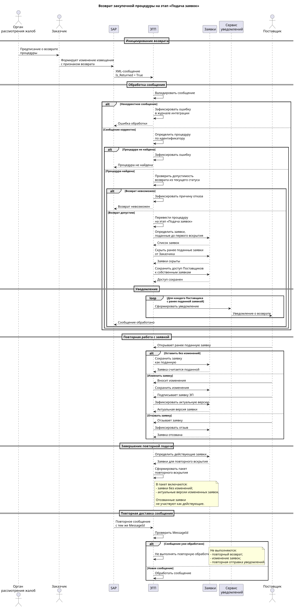

# Задача: возврат закупочной процедуры на этап подачи заявок

## 1. Контекст

SAP передает на ЭТП изменение закупочной процедуры.

Для возврата процедуры на этап «Подача заявок» SAP должен передать признак:

`Is_Returned = True`.

После получения сообщения ЭТП должна обработать возврат процедуры и обеспечить возможность повторной работы Поставщиков с ранее поданными заявками.

---

## 2. Что необходимо реализовать

### 2.1. Обработка входящего сообщения

При получении `Is_Returned = True`:

1. определить процедуру;
2. проверить возможность возврата из текущего статуса;
3. перевести процедуру в статус «Подача заявок»;
4. определить заявки, поданные до первого вскрытия;
5. изменить доступность этих заявок согласно бизнес-правилам;
6. сформировать уведомления участникам.

### 2.2. Работа с заявками

Для ранее поданных заявок необходимо обеспечить три сценария:

| Действие Поставщика | Результат |
|---|---|
| Оставил заявку без изменений | Заявка считается поданной и участвует во вскрытии |
| Изменил заявку и подписал ЭП | В процессе участвует актуальная версия |
| Отозвал заявку | Заявка не участвует как действующая |

При этом ранее поданные заявки не удаляются.

Для Заказчика заявки должны быть скрыты до завершения повторного этапа подачи.

---

## 3. Use Cases

### UC-01. Возврат закупочной процедуры на этап «Подача заявок»

**Акторы:** SAP, ЭТП

**Предусловия:**
- закупочная процедура существует на ЭТП;
- SAP формирует сообщение об изменении процедуры;
- сообщение содержит `Is_Returned = True`.

**Триггер:**

ЭТП получает сообщение от SAP с признаком возврата процедуры.

**Основной сценарий:**

1. SAP формирует сообщение об изменении закупочной процедуры.
2. SAP передает сообщение на ЭТП.
3. ЭТП принимает сообщение.
4. ЭТП валидирует входящее сообщение.
5. ЭТП определяет закупочную процедуру.
6. ЭТП проверяет, допускает ли текущий статус процедуры возврат на этап «Подача заявок».
7. ЭТП переводит процедуру на этап «Подача заявок».
8. ЭТП определяет заявки, поданные до первого вскрытия.
9. ЭТП скрывает ранее поданные заявки от Заказчика.
10. ЭТП сохраняет доступ Поставщиков к собственным ранее поданным заявкам.
11. ЭТП формирует уведомления соответствующим Поставщикам.
12. ЭТП отправляет уведомления.

**Результат:**

- процедура находится на этапе «Подача заявок»;
- ранее поданные заявки не отображаются Заказчику;
- Поставщики сохраняют доступ к собственным заявкам;
- Поставщикам направлено уведомление.

**Альтернативные сценарии:**

**A1. Некорректное сообщение**

1. ЭТП получает сообщение.
2. Сообщение не соответствует актуальному XML-контракту.
3. ЭТП не изменяет состояние процедуры.
4. Ошибка фиксируется в журнале интеграции.

**A2. Процедура не найдена**

1. ЭТП получает сообщение.
2. ЭТП не может определить процедуру по идентификатору из сообщения.
3. Состояние процедур не изменяется.
4. Ошибка фиксируется в журнале интеграции.

**A3. Возврат невозможен из текущего статуса**

1. ЭТП определяет процедуру.
2. Текущий статус процедуры не допускает возврат.
3. Переход на этап «Подача заявок» не выполняется.
4. Заявки не изменяются.
5. Причина отказа фиксируется в журнале.

---

### UC-02. Оставление ранее поданной заявки без изменений

**Актор:** Поставщик

**Предусловия:**

- процедура возвращена на этап «Подача заявок»;
- Поставщик ранее подал заявку до первого вскрытия;
- заявка доступна Поставщику.

**Основной сценарий:**

1. Поставщик получает уведомление о возврате процедуры.
2. Поставщик открывает ранее поданную заявку.
3. Поставщик не вносит изменений.
4. Повторный этап подачи заявок завершается.
5. ЭТП определяет действующие заявки для повторного вскрытия.
6. Ранее поданная заявка включается в пакет вскрытия.

**Результат:**

Заявка продолжает считаться поданной и участвует в повторном вскрытии.

---

### UC-03. Изменение ранее поданной заявки

**Актор:** Поставщик

**Предусловия:**

- процедура возвращена на этап «Подача заявок»;
- Поставщик ранее подал заявку до первого вскрытия;
- заявка доступна Поставщику.

**Основной сценарий:**

1. Поставщик получает уведомление о возврате процедуры.
2. Поставщик открывает ранее поданную заявку.
3. Поставщик вносит необходимые изменения.
4. Поставщик повторно подает заявку.
5. Заявка подписывается ЭП.
6. После завершения повторного этапа подачи заявок ЭТП определяет актуальную версию заявки.
7. Актуальная версия заявки используется в дальнейшем процессе закупки.

**Результат:**

Измененная и подписанная заявка считается актуальной для дальнейшего процесса закупки.

> **Требует уточнения:** способ хранения версий заявки и правило замещения предыдущей версии.

---

### UC-04. Отзыв ранее поданной заявки

**Актор:** Поставщик

**Предусловия:**

- процедура возвращена на этап «Подача заявок»;
- Поставщик ранее подал заявку до первого вскрытия;
- заявка доступна Поставщику.

**Основной сценарий:**

1. Поставщик получает уведомление о возврате процедуры.
2. Поставщик открывает ранее поданную заявку.
3. Поставщик выполняет отзыв заявки.
4. ЭТП фиксирует отзыв заявки.
5. После завершения повторного этапа подачи заявок ЭТП формирует состав действующих заявок.
6. Отозванная заявка не включается в состав действующих заявок повторного вскрытия.

**Результат:**

Отозванная заявка не считается действующей поданной заявкой.

> **Требует уточнения:** конкретный статус заявки после отзыва.

---

### UC-05. Формирование состава заявок для повторного вскрытия

**Актор:** ЭТП

**Предусловия:**

- процедура была возвращена на этап «Подача заявок»;
- повторный этап подачи заявок завершен.

**Основной сценарий:**

1. ЭТП определяет заявки, поданные до первого вскрытия.
2. ЭТП учитывает действия Поставщиков после возврата процедуры.
3. Заявки, оставленные без изменений, сохраняют статус поданных.
4. Для измененных заявок используется актуальная версия.
5. Отозванные заявки исключаются из состава действующих заявок.
6. ЭТП формирует пакет повторного вскрытия.

**Результат:**

Пакет повторного вскрытия содержит актуальный состав действующих заявок.

> **Требует уточнения:** точные правила формирования пакета повторного вскрытия.

---

### UC-06. Отправка уведомления Поставщику

**Актор:** ЭТП

**Предусловия:**

- процедура успешно возвращена на этап «Подача заявок»;
- Поставщик подал заявку до первого вскрытия.

**Основной сценарий:**

1. ЭТП определяет Поставщиков, подавших заявки до первого вскрытия.
2. Для каждого Поставщика ЭТП формирует уведомление.
3. В уведомление передаются:
   - номер закупки;
   - дата и время окончания подачи заявок;
   - номер заявки;
   - информация о необходимости проверить заявку;
   - информация о возможности внести изменения и повторно подать заявку с подписанием ЭП.
4. ЭТП отправляет уведомление Поставщику.

**Результат:**

Поставщик получает уведомление о возврате процедуры.

**Альтернативный сценарий:**

**A1. Ошибка отправки уведомления**

1. ЭТП не может доставить уведомление одному из Поставщиков.
2. Возврат процедуры не отменяется.
3. Ошибка фиксируется в журнале.
4. Механизм повторной отправки определяется отдельно.

---

### UC-07. Повторная обработка входящего сообщения

**Актор:** ЭТП

**Предусловия:**

- ЭТП ранее успешно обработала сообщение;
- сообщение содержит тот же `MessageId`.

**Основной сценарий:**

1. ЭТП получает сообщение повторно.
2. ЭТП определяет, что сообщение с данным `MessageId` уже было обработано.
3. Повторное изменение состояния процедуры не выполняется.
4. Повторное изменение состояния заявок не выполняется.
5. Повторная отправка уведомлений не выполняется.

**Результат:**

Повторная обработка одного и того же сообщения не приводит к повторному выполнению побочных действий.

> **Требует уточнения:** подтверждено ли использование `MessageId` в качестве ключа идемпотентности интеграционного сообщения.
---

## 4. Sequence Diagram

Диаграмма описывает взаимодействие SAP, ЭТП, заявок, сервиса уведомлений и Поставщика при возврате закупочной процедуры на этап «Подача заявок».


---

## 3. Интеграционный контракт

**Направление:** SAP → ЭТП

**Формат:** XML

**Признак возврата:**

```
<Is_Returned>True</Is_Returned>
## 4. Идемпотентность

Необходимо исключить повторную обработку одного и того же сообщения.

В XML предусмотрено поле:

<MessageId>%MessageId%</MessageId>
```


## 4. Уведомления

После успешного возврата процедуры необходимо отправить уведомление всем Поставщикам, которые подали заявки до первого вскрытия.

### 4.1. Текст уведомления

> В рамках закупки «№ ЭТП» была подана жалоба, по результатам ее рассмотрения закупка возвращена на этап подачи заявок до *дата и время окончания подачи заявок*, Вам необходимо проверить заявку за номером *номер заявки на ЭТП* при необходимости внести изменения и подать заявку, подписав ЭП.

### 4.2. Данные для формирования уведомления

| Параметр | Источник |
|---|---|
| Номер закупки | Данные процедуры |
| Дата и время окончания подачи заявок | Данные процедуры |
| Номер заявки | Данные заявки |
| Получатель | Поставщик, подавший заявку |

Ошибка отправки уведомления отдельному Поставщику не должна отменять уже выполненный возврат процедуры.

> **Требует уточнения:** необходимо определить механизм повторной отправки уведомления при ошибке доставки.

---

## 5. Обработка ошибок

### 5.1. Некорректное входящее сообщение

Если XML не соответствует актуальному контракту:

- сообщение не обрабатывается;
- процедура не изменяется;
- ошибка фиксируется в журнале интеграции.

### 5.2. Процедура не найдена

Если процедура по идентификатору из сообщения не найдена:

- процедура не изменяется;
- сообщение не считается успешно обработанным;
- ошибка фиксируется в журнале интеграции.

### 5.3. Недопустимый статус процедуры

Если текущий статус процедуры не позволяет выполнить возврат:

- переход в статус «Подача заявок» не выполняется;
- заявки не изменяются;
- причина отказа фиксируется в журнале.

### 5.4. Ошибка обработки отдельной заявки

Ошибка обработки одной заявки не должна приводить к удалению или изменению остальных заявок.

Ошибка должна быть зафиксирована в журнале для последующего анализа.

---

## 6. Acceptance Criteria

### AC-01. Возврат процедуры

**Дано:** ЭТП получила валидное сообщение с `Is_Returned = True`.

**Когда:** сообщение успешно обработано.

**Тогда:** процедура переведена в статус «Подача заявок».

### AC-02. Скрытие заявок от Заказчика

**Дано:** до первого вскрытия были поданы заявки.

**Когда:** процедура возвращена на этап «Подача заявок».

**Тогда:** ранее поданные заявки не отображаются Заказчику.

### AC-03. Доступ Поставщика к заявке

**Дано:** Поставщик подал заявку до первого вскрытия.

**Когда:** процедура возвращена на этап «Подача заявок».

**Тогда:** Поставщик получает доступ к своей заявке.

### AC-04. Заявка без изменений

**Дано:** Поставщик оставил ранее поданную заявку без изменений.

**Когда:** этап подачи заявок завершен.

**Тогда:** заявка считается поданной и включается в пакет вскрытия.

### AC-05. Изменение заявки

**Дано:** Поставщик изменил заявку и подписал ее ЭП.

**Когда:** этап подачи заявок завершен.

**Тогда:** в дальнейшем процессе используется актуальная версия заявки.

### AC-06. Отзыв заявки

**Дано:** Поставщик отозвал ранее поданную заявку.

**Когда:** этап подачи заявок завершен.

**Тогда:** отозванная заявка не участвует как действующая заявка в повторном вскрытии.

### AC-07. Уведомление

**Дано:** Поставщик подал заявку до первого вскрытия.

**Когда:** процедура успешно возвращена на этап «Подача заявок».

**Тогда:** Поставщику отправлено уведомление с номером закупки, номером заявки и датой/временем окончания подачи заявок.

### AC-08. Идемпотентность

**Дано:** сообщение с определенным `MessageId` уже было успешно обработано.

**Когда:** то же сообщение поступает повторно.

**Тогда:** повторная обработка возврата и повторная отправка уведомлений не выполняются.

### AC-09. Некорректное сообщение

**Дано:** входящее сообщение не соответствует требованиям XML-контракта.

**Когда:** ЭТП получает сообщение.

**Тогда:**

- процедура не изменяется;
- сообщение не считается успешно обработанным;
- ошибка фиксируется в журнале интеграции.

---
