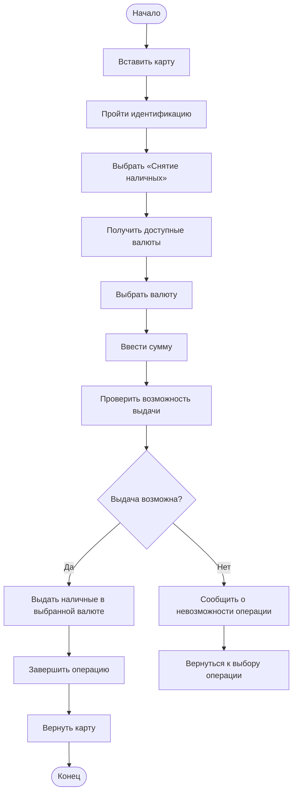

# DEV-001. Добавление поддержки дополнительной валюты при снятии наличных

## 1. Цель

Добавить в ПО банкомата возможность использовать дополнительную валюту
при выполнении операции снятия наличных.

Существующий сценарий снятия наличных в поддерживаемой валюте
должен сохраниться.

---

## 2. Контекст

В текущем сценарии клиент:

1. вставляет карту;
2. проходит идентификацию;
3. выбирает операцию «Снятие наличных»;
4. вводит сумму;
5. банкомат проверяет возможность выполнения операции;
6. при успешной проверке выдаёт наличные;
7. завершает операцию.

Требуется расширить сценарий возможностью выбора валюты перед вводом
суммы.

---

## 3. Требуемое изменение

Добавить в сценарий снятия наличных шаг выбора валюты.

User Flow:

---

## 4. Functional Requirements
### FR-01. Поддержка дополнительной валюты

ПО банкомата должно поддерживать выполнение операции снятия
наличных в согласованной дополнительной валюте.

Дополнительная валюта: TBD

### FR-02. Получение доступных валют

Система должна определить набор валют, доступных для выдачи
в конкретном банкомате.

### FR-03. Отображение доступных валют

При выборе операции «Снятие наличных» клиенту должны отображаться
доступные валюты.

Недоступные для конкретного банкомата валюты не должны отображаться
как доступные для выбора.

### FR-04. Выбор валюты

Клиент должен иметь возможность выбрать валюту операции.

Выбранная валюта должна сохраняться в контексте текущей операции
до её завершения или отмены.

### FR-05. Ввод суммы

После выбора валюты клиент должен указать сумму снятия.

Сумма должна интерпретироваться в выбранной валюте.

### FR-06. Проверка возможности выдачи

Перед выдачей наличных система должна проверить возможность
выполнения операции в выбранной валюте и на указанную сумму.

### FR-07. Успешная выдача

Если операция разрешена и необходимая сумма доступна,
банкомат должен выдать наличные в выбранной валюте.

### FR-08. Недоступная валюта

Если выбранная валюта недоступна для выдачи:

 - наличные не выдаются;
 - операция не завершается успешно;
 - клиенту отображается сообщение о невозможности операции.

### FR-09. Сохранение существующего поведения

Если клиент выбирает ранее поддерживаемую валюту,
операция должна выполняться по существующему сценарию.

---

## 5. Non-functional Requirements

На основании исходного задания конкретные нефункциональные требования не определены.

До реализации необходимо определить применимые требования к:

* безопасности;
* производительности;
* времени ответа;
* доступности;
* отказоустойчивости;
* корректности финансовой операции;
* журналированию;
* аудиту;
* локализации;
* совместимости с используемыми моделями и конфигурациями банкоматов.

Конкретные числовые значения не устанавливаются без соответствующих требований заказчика.

---

## 6. API / Integration
Общие требования

Изменение существующих API или добавление новых API определяется
после анализа текущей реализации.

В рамках исходного задания конкретные API-контракты
не предоставлены.

### 6.2. Передача валюты

При выполнении операции снятия информация о выбранной валюте
должна передаваться в компонент, отвечающий за выполнение операции.

Логическое значение:

WithdrawalRequest
├── amount
└── currency

Конкретный формат API требует согласования с существующим
контрактом системы.

### 6.3. Внешние системы

При необходимости изменения внешнего банковского или
процессингового взаимодействия соответствующие API-контракты
должны быть согласованы отдельно.

## 7. Data
Для операции снятия необходимо учитывать валюту операции.

Логическая модель:

Withdrawal
├── id
├── amount
├── currency
└── status

Currency
| Поле | Тип    | Описание            |
| ---- | ------ | ------------------- |
| code | String | Код валюты          |
| name | String | Наименование валюты |

Withdrawal
| Поле     | Тип      | Описание                     |
| -------- | -------- | ---------------------------- |
| id       | String   | Идентификатор операции       |
| amount   | Decimal  | Сумма снятия                 |
| currency | Currency | Валюта операции              |
| status   | Status   | Результат/состояние операции |

---

## 8. Ошибки

### ER-01. Валюта недоступна

Условие: выбранная валюта отсутствует среди доступных валют.

Результат:

- операция не выполняется;
- наличные не выдаются;
- клиенту отображается сообщение.
### ER-02. Невозможность выдачи

Условие: выбранная валюта доступна, но операция на указанную
сумму не может быть выполнена.

Результат:

- наличные не выдаются;
- клиенту отображается сообщение о невозможности операции.
### ER-03. Ошибка внешней системы

Условие: внешняя система, участвующая в выполнении операции,
возвращает ошибку.

Результат:

- операция не считается успешно завершённой;
- наличные не должны выдаваться.

Конкретные коды ошибок и тексты сообщений в исходном задании
не определены.

### ER-04. Ошибка оборудования

Условие: аппаратная часть не может выполнить выдачу.

Результат:

- операция не считается успешно завершённой;
- ошибка обрабатывается согласно существующему механизму
обработки ошибок ATM.
